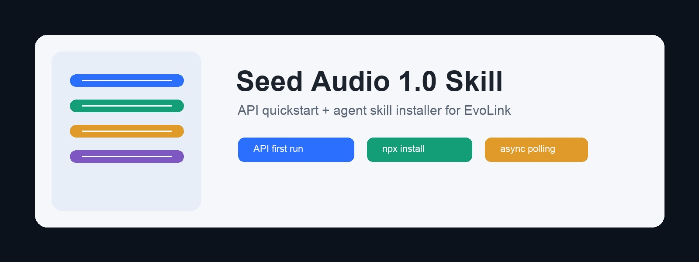
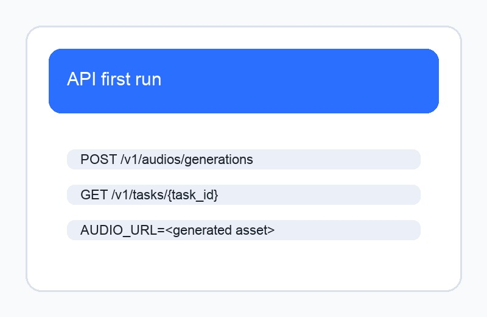
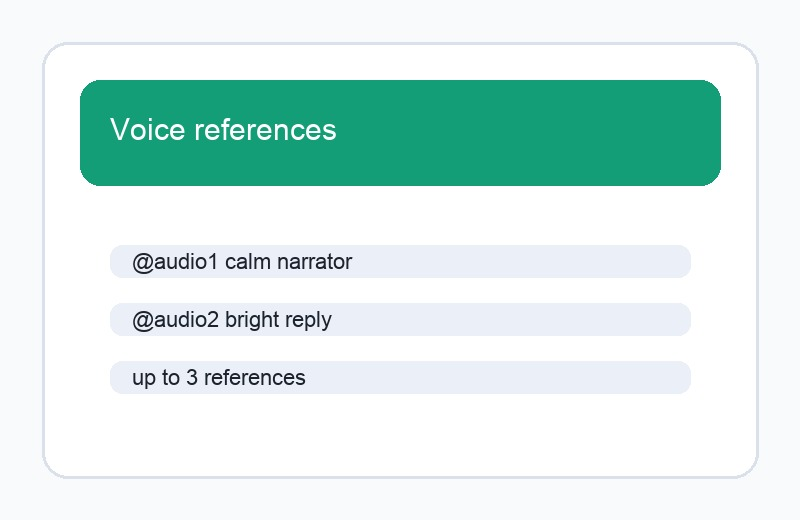
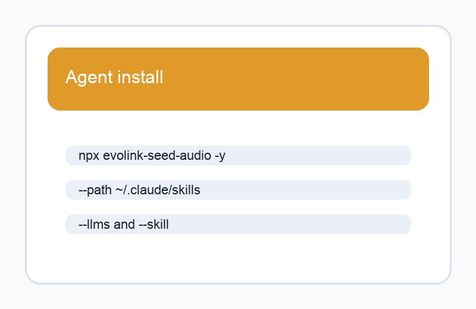

# Seed Audio 1.0 Skill

<p align="center">
  <strong>Generate speech, dialogue, ambience, sound effects, and mixed audio scenes with Seed Audio 1.0 through EvoLink.</strong>
</p>

<p align="center">
  <a href="https://docs.evolink.ai/en/api-manual/audio-series/doubao-seed-audio/doubao-seed-audio-1-0?utm_source=github&utm_medium=repo&utm_campaign=seed-audio-1-0-skill&utm_content=banner">
    
  </a>
</p>

<p align="center">
  <a href="https://www.npmjs.com/package/evolink-seed-audio"></a>
  <a href="LICENSE"></a>
  <a href="https://github.com/cheercheung/seed-audio-1-0-skill/stargazers"></a>
  <a href="https://github.com/cheercheung/seed-audio-1-0-skill/commits/main/"></a>
</p>

<p align="center">
  <a href="#-menu">Menu</a> -
  <a href="#installation">Install</a> -
  <a href="#-showcase">Showcase</a> -
  <a href="#seed-audio-api-and-skill">API + Skill</a> -
  <a href="#getting-an-api-key">API Key</a> -
  <a href="https://evolink.ai/seed-audio-1-0?utm_source=github&utm_medium=repo&utm_campaign=seed-audio-1-0-skill&utm_content=readme-top">Try on EvoLink</a>
</p>

> **AI Agent?** Skip the README, go straight to [**llms-install.md**](llms-install.md) for step-by-step installation instructions designed for you.

---

## 📑 Menu

- [What is This?](#what-is-this)
- [Installation](#installation)
- [Getting an API Key](#getting-an-api-key)
- [Showcase](#-showcase)
- [Seed-Audio API And Skill](#seed-audio-api-and-skill)
- [File Structure](#file-structure)
- [Troubleshooting](#troubleshooting)
- [Compatibility](#compatibility)
- [License](#license)
- [Community](#community)
- [Star History](#star-history)

## What is This?

| Field | Value |
|---|---|
| Skill | Seed Audio 1.0 Skill |
| Model | `doubao-seed-audio-1-0` |
| Maintained surface | `api-skill` |
| User entrances | API quickstart and agent skill install |

Use this repository when you want to:

- call the EvoLink Seed-Audio API with a complete async create-and-poll flow
- install an agent skill with `npx evolink-seed-audio`
- generate narration, multi-character dialogue, ambience, sound effects, and mixed audio scenes
- inspect request parameters, response shapes, callbacks, errors, and voice references

---

## Installation

### Quick Install (OpenClaw)

```bash
openclaw skills add https://github.com/cheercheung/seed-audio-1-0-skill
```

### Install via npm (Recommended)

```bash
npx evolink-seed-audio
```

Silent install for agents:

```bash
npx evolink-seed-audio -y
```

Install to a specific skills directory:

```bash
npx evolink-seed-audio -y --path ~/.claude/skills
```

### Manual Install

```bash
git clone https://github.com/cheercheung/seed-audio-1-0-skill.git
cd seed-audio-1-0-skill
openclaw skills add .
```

### Agent Auto-Install

Claude Code:

```text
Install the Seed Audio skill by running:
npx evolink-seed-audio@latest -y --path ~/.claude/skills

Then set EVOLINK_API_KEY and read:
~/.claude/skills/seed-audio-1-0/SKILL.md
```

OpenCode:

```text
Install the Seed Audio skill by running:
npx evolink-seed-audio@latest -y --path ~/.opencode/skills

Then set EVOLINK_API_KEY and read:
~/.opencode/skills/seed-audio-1-0/SKILL.md
```

OpenClaw:

```text
Install the Seed Audio skill by running:
npx evolink-seed-audio@latest -y --path ~/.openclaw/skills

Then set EVOLINK_API_KEY and read:
~/.openclaw/skills/seed-audio-1-0/SKILL.md
```

One-Liner:

```bash
EVOLINK_API_KEY=your_key_here npx evolink-seed-audio@latest -y --path ~/.claude/skills
```

---

## Getting an API Key

1. Open [EvoLink API Keys](https://evolink.ai/dashboard/keys?utm_source=github&utm_medium=repo&utm_campaign=seed-audio-1-0-skill&utm_content=api-key).
2. Create or copy an API key.
3. Export it in your shell:

```bash
export EVOLINK_API_KEY="your_key_here"
```

4. Start a generation task:

```bash
scripts/seed-audio-generate.sh \
  --prompt "Create a short welcome narration with a warm studio voice." \
  --format mp3
```

---

## 🖼️ Showcase

| API first run | Voice references | Agent install |
|---|---|---|
|  |  |  |
| Create a task, poll status, and print generated audio URLs. | Use preset voices or reference-audio URLs with `@audio1`, `@audio2`, and `@audio3`. | Install the skill into Claude Code, OpenCode, OpenClaw, or Cursor skills directories. |

---

## Seed-Audio API And Skill

### Quick API Request

```bash
curl --request POST \
  --url https://api.evolink.ai/v1/audios/generations \
  --header "Authorization: Bearer ${EVOLINK_API_KEY}" \
  --header "Content-Type: application/json" \
  --data '{
    "model": "doubao-seed-audio-1-0",
    "prompt": "Create a 20-second premium product video audio bed: soft electronic music, subtle camera whoosh, a glass bottle placed on marble, calm female narration, clean studio ambience.",
    "format": "mp3",
    "sample_rate": 24000
  }'
```

The API is asynchronous. The create request returns a task `id`; poll until the task is `completed`, `failed`, or `cancelled`:

```bash
curl --request GET \
  --url "https://api.evolink.ai/v1/tasks/{task_id}" \
  --header "Authorization: Bearer ${EVOLINK_API_KEY}"
```

### Complete First-Run Flow

```bash
node examples/javascript/complete-flow.mjs
```

Or use the packaged script:

```bash
scripts/seed-audio-generate.sh \
  --prompt "Create a cinematic 15-second rainforest ambience with distant birds, light rain, and a calm documentary narrator." \
  --format mp3
```

### Generation Modes

| Mode | How to use it |
|---|---|
| Text to audio | Pass `prompt` only. |
| Voice reference | Pass up to 3 `audio_references`; refer to them as `@audio1`, `@audio2`, `@audio3` in the prompt. |
| Reference image | Pass one `image_urls` item. Do not combine `image_urls` with `audio_references`. |
| Callback | Pass `callback_url` to receive terminal task states. |

### Script Reference

```bash
scripts/seed-audio-generate.sh --help
npx evolink-seed-audio@latest --llms
npx evolink-seed-audio@latest --skill
```

### API Parameters

| Parameter | Required | Notes |
|---|---:|---|
| `model` | yes | Use `doubao-seed-audio-1-0` |
| `prompt` | yes | Up to 1500 characters |
| `audio_references` | no | Up to 3 preset voices or reference-audio URLs |
| `image_urls` | no | One reference image URL |
| `format` | no | `wav`, `mp3`, `pcm`, `ogg_opus`; default `wav` |
| `sample_rate` | no | `8000`, `16000`, `24000`, `32000`, `44100`, `48000` |
| `speech_rate` | no | `0.5` to `2.0` |
| `loudness_rate` | no | `0.5` to `2.0` |
| `pitch_rate` | no | `-12` to `12` semitones |
| `callback_url` | no | HTTPS callback URL for terminal task states |

See [docs/api-reference.md](docs/api-reference.md), [docs/task-lifecycle.md](docs/task-lifecycle.md), [docs/response-schema.md](docs/response-schema.md), [docs/errors.md](docs/errors.md), [docs/callbacks.md](docs/callbacks.md), [docs/voices.md](docs/voices.md), and [references/api-params.md](references/api-params.md).

---

## File Structure

```text
.
├── README.md
├── SKILL.md
├── llms-install.md
├── _meta.json
├── package.json
├── bin/cli.js
├── scripts/seed-audio-generate.sh
├── docs/
├── examples/
├── references/
└── assets/
```

---

## Troubleshooting

| Issue | Likely cause | Action |
|---|---|---|
| `EVOLINK_API_KEY is not set` | Missing API key | Export `EVOLINK_API_KEY` and retry. |
| `create request failed` | Invalid key, request body, or network failure | Run with `--dry-run`, then check `docs/errors.md`. |
| `POLL_TIMEOUT` | The task did not finish before local polling ended | Query `GET /v1/tasks/{task_id}` later. Do not resubmit automatically. |
| No audio URL found | Response shape changed or task has no generated asset yet | Save the full task JSON and compare with `docs/response-schema.md`. |

---

## Compatibility

| Agent or runtime | Install method | Status |
|---|---|---|
| Claude Code | `npx evolink-seed-audio -y --path ~/.claude/skills` | Supported |
| OpenCode | `npx evolink-seed-audio -y --path ~/.opencode/skills` | Supported by path install |
| OpenClaw | `openclaw skills add` or `npx ... --path ~/.openclaw/skills` | Supported |
| Cursor | `npx ... --path ~/.cursor/skills` or project `.cursor/skills` | Supported |
| Node.js | `>=16` | Required by `package.json` |
| Shell | bash + curl + python3 | Required by `scripts/seed-audio-generate.sh` |

---

## License

MIT. See [LICENSE](LICENSE).

---

## Community

- [Try Seed-Audio on EvoLink](https://evolink.ai/seed-audio-1-0?utm_source=github&utm_medium=repo&utm_campaign=seed-audio-1-0-skill&utm_content=community)
- [Create an EvoLink API key](https://evolink.ai/dashboard/keys?utm_source=github&utm_medium=repo&utm_campaign=seed-audio-1-0-skill&utm_content=community-api-key)
- [Read the official API docs](https://docs.evolink.ai/en/api-manual/audio-series/doubao-seed-audio/doubao-seed-audio-1-0?utm_source=github&utm_medium=repo&utm_campaign=seed-audio-1-0-skill&utm_content=community-docs)
- [Read the official voice list](https://docs.evolink.ai/en/api-manual/audio-series/doubao-seed-audio/doubao-seed-audio-1-0-voices?utm_source=github&utm_medium=repo&utm_campaign=seed-audio-1-0-skill&utm_content=community-voices)

---

## Star History

```text
Star history becomes available after the repository is public.
```

<p align="center">
  Powered by <a href="https://evolink.ai?utm_source=github&utm_medium=repo&utm_campaign=seed-audio-1-0-skill&utm_content=footer">EvoLink</a>
</p>
